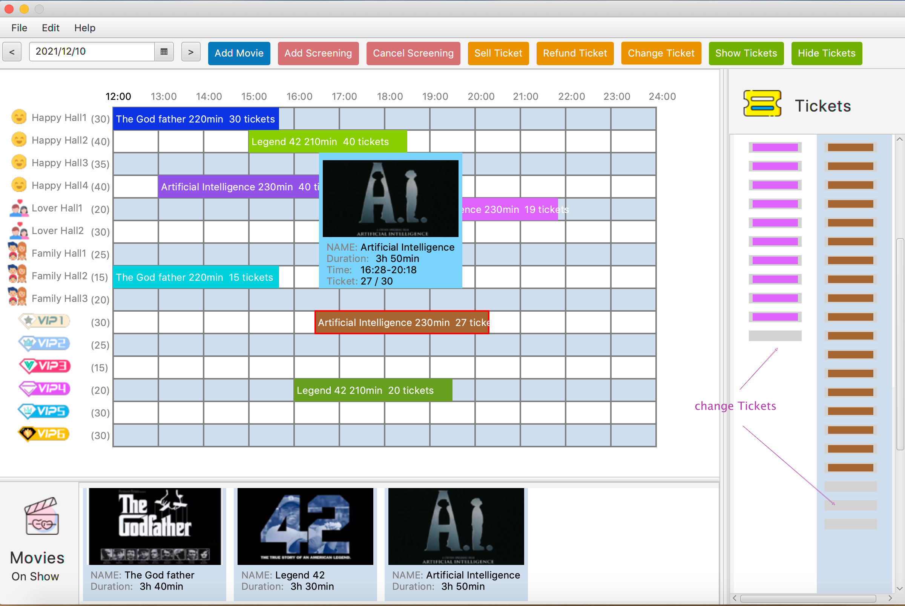
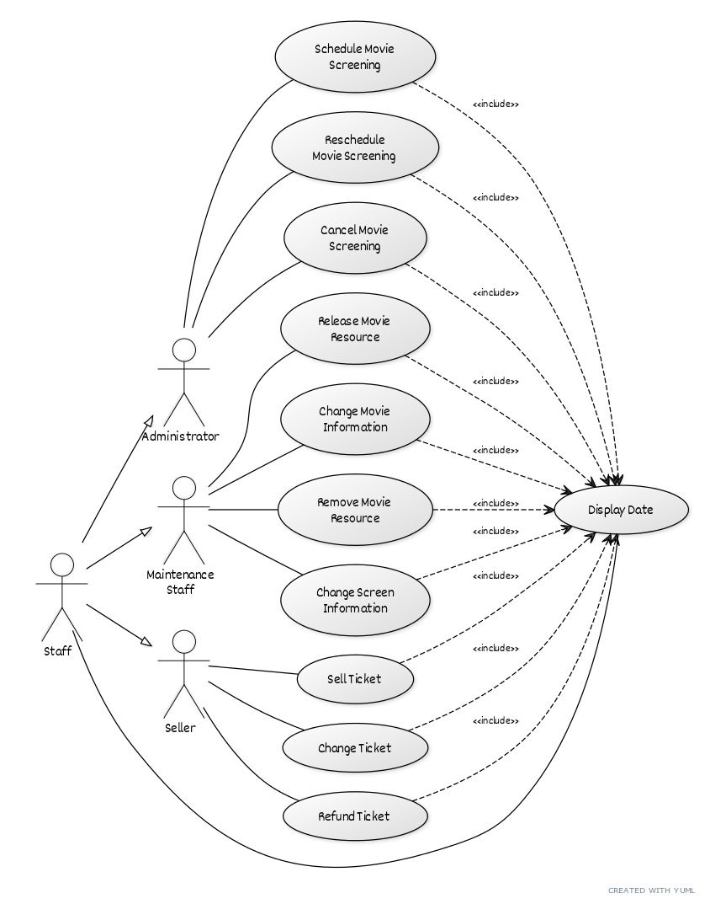
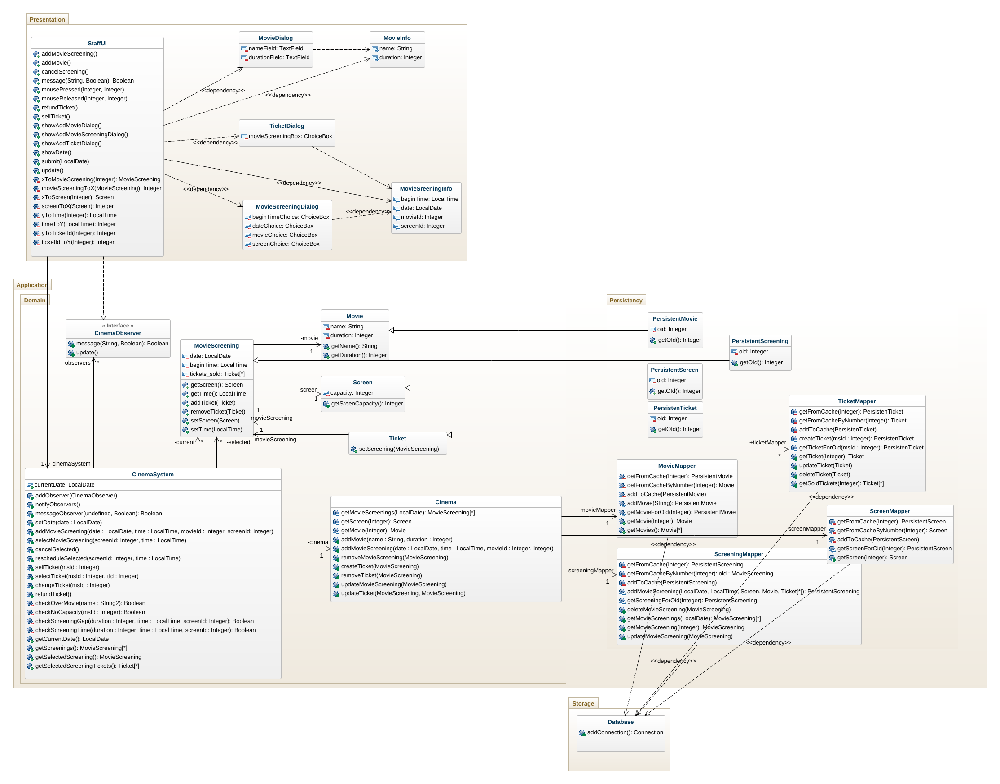

# Cinema-Cinema-Management-and-Booking-System
A information system implemented by Java. The software is designed for a small cinema that has about 5 - 10 screens. These screen can vary in
size from big enough to fit about 30 people to big enough for about 100 people. Screens can only be used to
show one movie at any time and the duration of the movie should determine how long the screen is used for (it
would also be a good idea to require 15 minutes between screenings for customers too leave and new customers
to arrive). We should only be able to sell tickets up to the capacity of the screen, if we attempt to sell any more
there should be an error.

## Description

This project will involve the design and implementation of a software system for the management of a cinema.
This will be a single user desktop application with a graphical user interface.
There are two parts to the software, an administrative panel that allows scheduling the movies that will be
shown and which screens they will be shown on and ticket panel that can be used by the staff to sell tickets to
the customers of the cinema. It is implemented as a single application.

## Use cases

## Class diagram

